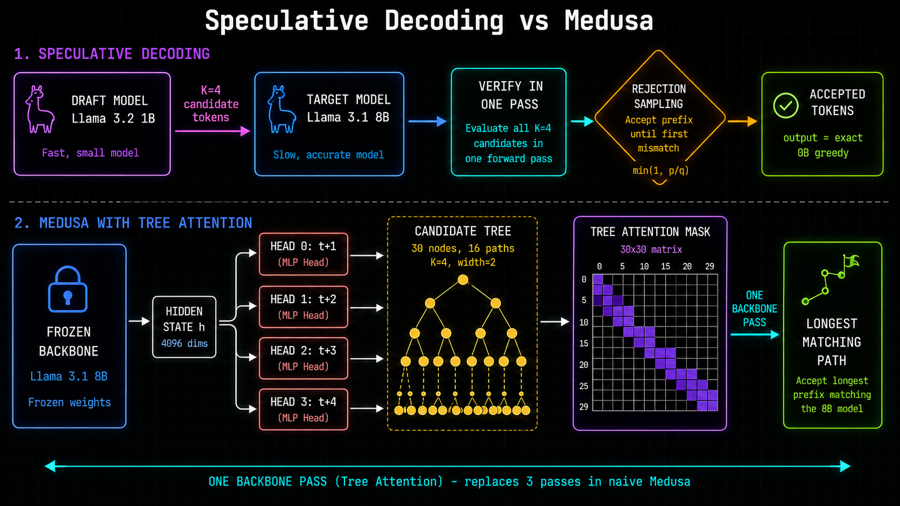
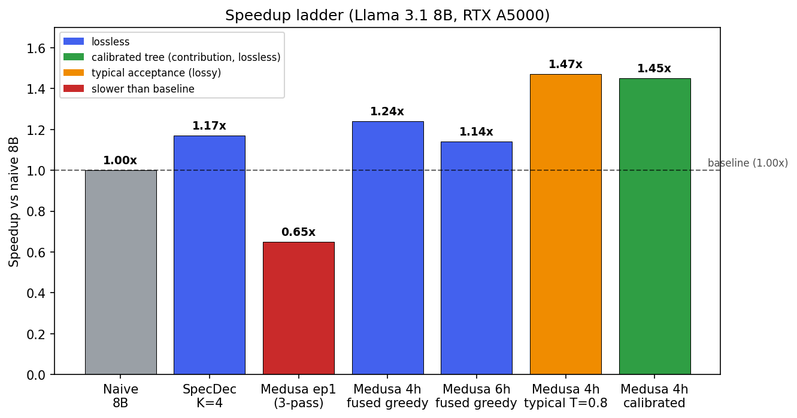

# SpecDecode

Built this to understand speculative decoding from first principles, not just run someone else's implementation.
Implements three inference strategies on Llama models, measures the speedup, and visualizes what is actually happening at the token level.

 

---


*Implementation uses K=4.*

---

## What it does

**Speculative decoding** runs a small draft model to propose K tokens at once, then verifies all K in a single pass of the big target model. If the draft was right, you get K tokens for roughly the price of one. If it was wrong, you get one corrected token and try again. The output is mathematically identical to running the big model alone.

**Medusa** takes this further by replacing the separate draft model with small MLP heads attached directly to the frozen backbone. The heads predict future tokens from the same hidden state the backbone already computed, so there is no second model to run. With tree attention, the heads propose a tree of candidate paths that get verified in one pass instead of three.

The main contribution here is a **calibrated candidate tree**: measure each head's prediction accuracy offline, then allocate a fixed node budget to the most-likely-accepted guesses by Prim's-style greedy selection. The optimizer automatically drops the weakest head, lifting the **lossless** speedup from 1.24× to 1.34–1.56× at the same compute budget.

---

## Results

Hardware: 2x NVIDIA RTX A5000 (24GB each), CUDA 12.4
Target model: Llama-3.1-8B-Instruct
Draft model: Llama-3.2-1B-Instruct



**Headline (two numbers, honest about the tradeoff):**
- **1.24–1.56x — lossless.** 4-head Medusa with a fused tree decoder under strict-greedy acceptance
  is provably bit-identical to standard greedy decoding (verified by self-consistency, 101/101 tokens
  argmax-or-tied). The **calibrated tree** (Extension A) lifts the base 1.24x to 1.34–1.56x by
  spending the node budget on high-probability candidates — still zero quality cost.
- **~1.47x — with typical acceptance (T=0.8).** Trades exact-greedy for a looser accept rule.
  Coherent across prompt types but *lossy* (temperature sampling, not identical to greedy).

| Config | tok/s | Speedup | notes |
|---|---|---|---|
| Naive 8B baseline | 37.9 | 1.00x | |
| SpecDecode K=4 (separate 1B draft) | 44.4 | 1.17x | 1B draft model, instruct |
| Medusa greedy, epoch-1 heads (3-pass) | 24.6 | 0.65x | early, undertrained heads |
| **Medusa 4-head, fused tree, greedy** | **47.0** | **1.24x** | **lossless — bit-identical to greedy decoding** |
| Medusa 6-head, fused tree, greedy | 43.3 | 1.14x | *slower*: far heads rejected under strict greedy (optimal-K overshoot) |
| **Medusa 4-head, fused tree, typical (T=0.8)** | **~55** | **~1.47x** | coherent, lossy; 1.27–1.67x across prompt types |
| **Medusa 4-head, calibrated tree, greedy** | **50.7–58.8** | **1.34–1.56x** | **lossless**; +6–15% acceptance over Cartesian, same node budget |

Two findings worth understanding from this table:
- **More heads can make greedy slower.** 6 heads (1.14x) underperform 4 heads (1.24x) under strict
  greedy: the extra far-future heads are almost always rejected, so they add tree-verification cost
  every round with near-zero accepted tokens — a live demonstration of the optimal-K cost model.
- **Typical acceptance is the only way deeper trees pay off**, but it is lossy and its safe
  temperature must be tuned against the *worst-case* prompt (a list prompt garbled at T=0.92 while
  prose stayed clean). T=0.8 is the robust operating point; speed is reported as a range across
  prompt types because acceptance depends on how predictable the text is.

---

## Architecture

```
Speculative decoding:

  [Llama 1B draft]  -->  K candidate tokens
                               |
  [Llama 8B target] -->  verify all K in one pass
                               |
                    rejection sampling (Leviathan et al.)
                               |
                    accepted tokens (output = exact 8B greedy)


Medusa (tree attention):

  [Llama 8B backbone] -->  hidden state h
                               |
              +----------------+----------------+
              |                |                |
           head 0           head 1           head 2  ...
         (top-2 at t+1)  (top-2 at t+2)  (top-2 at t+3)
              |
     tree of candidates (30 nodes, 16 paths for K=4, width=2)
              |
     one backbone pass with custom attention mask
              |
     longest matching path wins
```

---

## How to run

Requires a CUDA GPU (the 8B baseline needs ~16 GB VRAM; the Medusa path ~18 GB), Python 3.10+, and HuggingFace access to the gated Llama models.

```bash
pip install -r requirements.txt
huggingface-cli login        # the Llama models are gated — accept the license, then log in
```

**Checkpoints:** the trained Medusa head weights (`*.pt`) are *not* in the repo (gitignored — large binaries). Reproduce them with the training script below, or the Medusa scripts won't load. The naive baseline and the 1B-draft speculative path run without any checkpoint.

**Naive baseline:**
```bash
PYTHONPATH=. python scripts/baseline_bench.py
```

**SpecDecode K sweep:**
```bash
PYTHONPATH=. python scripts/k_sweep.py
```

**Three-way benchmark (naive vs SpecDecode vs Medusa):**
```bash
PYTHONPATH=. python scripts/benchmark_medusa.py
```

**Lossless check + fused/typical benchmarks** (need a checkpoint):
```bash
PYTHONPATH=. python scripts/verify_fused.py            # self-consistency: 1.24x, lossless
TEMP=0.8 PYTHONPATH=. python scripts/test_typical.py   # typical acceptance, ~1.47x coherent
```

**Calibrated tree — Extension A, the original contribution** (needs a checkpoint):
```bash
PYTHONPATH=. python scripts/calibrate_tree.py          # calibrate, then Cartesian vs calibrated (1.34–1.56x)
```

**Live demo (FastAPI + WebSocket, colour-coded tokens):**
```bash
# terminal 1, on the GPU box — loads 8B + heads, serves on :8000
PYTHONPATH=. python scripts/run_server.py
```
If your browser is on a different machine than the server, forward the port and open the page locally:
```bash
ssh -L 8000:localhost:8000 <user>@<gpu-host>     # from your laptop; keep this open
# then open frontend/index.html in your browser → pick "Medusa" → Generate
```
No-browser smoke test (prints accept-tagged tokens + acceptance %):
```bash
PYTHONPATH=. python scripts/test_server.py
```

---

## File structure

```
src/
  models.py       model loader (float16, device placement, eval mode)
  sampler.py      naive_generate, speculative_decode, rejection sampling
  medusa.py       MedusaHead, MedusaModel; decoders: medusa_decode,
                  medusa_decode_tree, medusa_decode_tree_fused (1 pass/round);
                  tree builders incl. build_tree_candidates_calibrated (Extension A)
  server.py       FastAPI server (POST /generate, WS /stream with live token coloring)

scripts/
  baseline_bench.py    measure naive tok/s (the 1.00x floor)
  compare_speed.py     naive vs 1B-draft speculative
  k_sweep.py           sweep K from 1 to 8 (find optimal K)
  profile_tree.py      phase-by-phase profile (shows the backbone passes dominate)
  width_sweep.py       why a wider tree doesn't help under greedy
  verify_fused.py      self-consistency lossless test (101/101 argmax-or-tied)
  test_typical.py      greedy vs typical + temperature sweep (TEMP=, PROMPT= env)
  calibrate_tree.py    Extension A: calibrate, then Cartesian vs calibrated tree
  train_medusa_8b.py   real training (8B, UltraChat)
  run_server.py        load model + heads, start uvicorn
  test_server.py       smoke-test both endpoints (naive + medusa)
  make_figures.py      regenerate the report/README charts (no GPU needed)

frontend/
  index.html      token visualization UI (vanilla JS, naive/medusa toggle)

report/
  report.tex      full technical report (the calibrated tree is the contribution)
```

---

## Training the Medusa heads

Backbone stays frozen. Only the 4 heads train.

```bash
# toy run on 5 paragraphs (sanity check, runs in minutes)
PYTHONPATH=. python scripts/train_medusa.py

# real run on UltraChat 25k, 2 epochs (takes a few hours on A5000)
PYTORCH_CUDA_ALLOC_CONF=expandable_segments:True PYTHONPATH=. python scripts/train_medusa_8b.py
```

Heads are saved as `medusa_heads_8b_epoch{n}.pt`. Not included in the repo (too large), but the training script reproduces them.

---

## What's next

- **Adaptive draft depth** — adjust tree depth online from a sliding window of recent acceptance (deeper on predictable text, shallower on hard text): the online version of what the calibrated tree solves offline.
- **Per-context calibration** — recalibrate the tree topology by domain (code vs. prose) instead of one global topology.
- **Batched speculative decoding** — verify many sequences' trees in one pass, for throughput under concurrent load.
- **MT-Bench quality eval** — formally quantify the typical path's quality cost (the greedy paths are already provably lossless).
- **Public deployment** — host the live visualization behind a small GPU.

Full method, math, and results are in [`report/report.tex`](report/report.tex).

---

## References

- Leviathan et al. (2023) - Fast Inference from Transformers via Speculative Decoding. [arXiv:2211.17192](https://arxiv.org/abs/2211.17192)
- Cai et al. (2024) - Medusa: Simple LLM Inference Acceleration Framework with Multiple Decoding Heads. [arXiv:2401.10774](https://arxiv.org/abs/2401.10774)
- Dao et al. (2022) - FlashAttention: Fast and Memory-Efficient Exact Attention with IO-Awareness. [arXiv:2205.14135](https://arxiv.org/abs/2205.14135)
